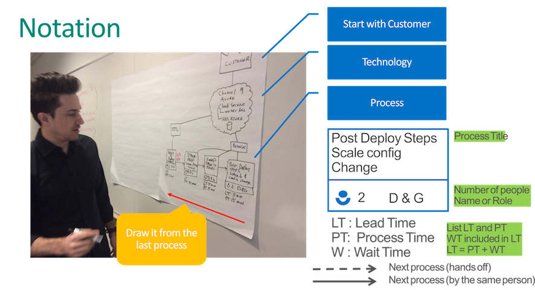

1. We always start with the customer. You should put the customer icon on the top right corner. 
2. the middle horizontal section of the map should be reserved to capture tools and technologies used by the different processes. You can capture this at any time, it is generally easier to do once a bunch of process are already mapped. 
3. Now we want to find what was the very last thing they did to deliver in production. Ask questions to find the answer.
4. Once you know what the last process is, it is time to actually map it. We want to capture the name of the process, who can execute it, it's process time (P.T.) it's lead time (L.T.) and waiting time (W.T.).
5. Repeat steps 3 and 4: "what was the last thing you did before this process?" until you reach the beginning of your value stream, which in most case is the ideation/conception phase. 

